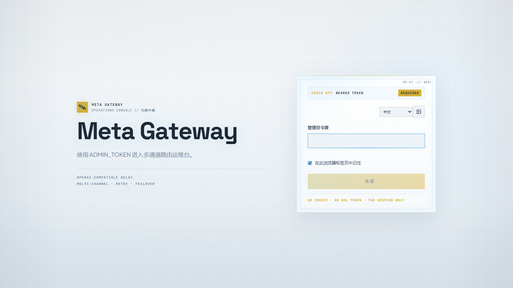
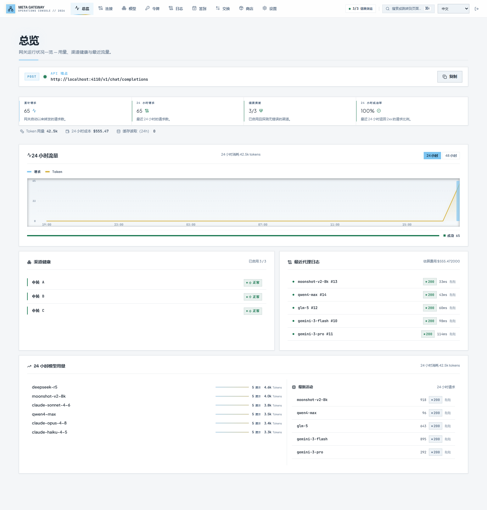
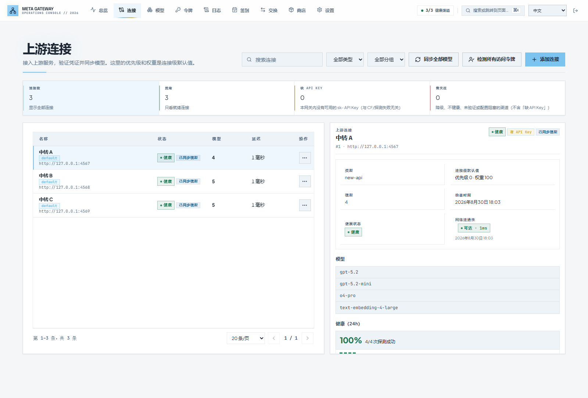
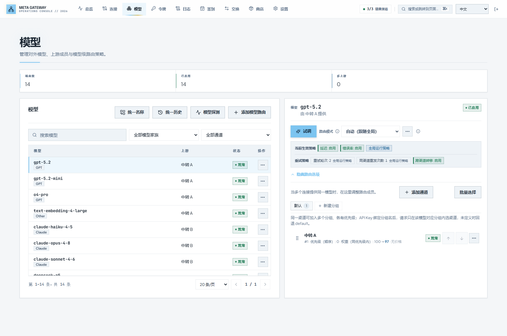
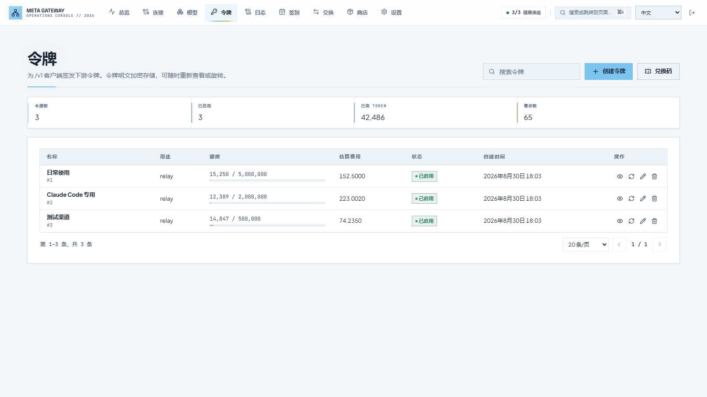
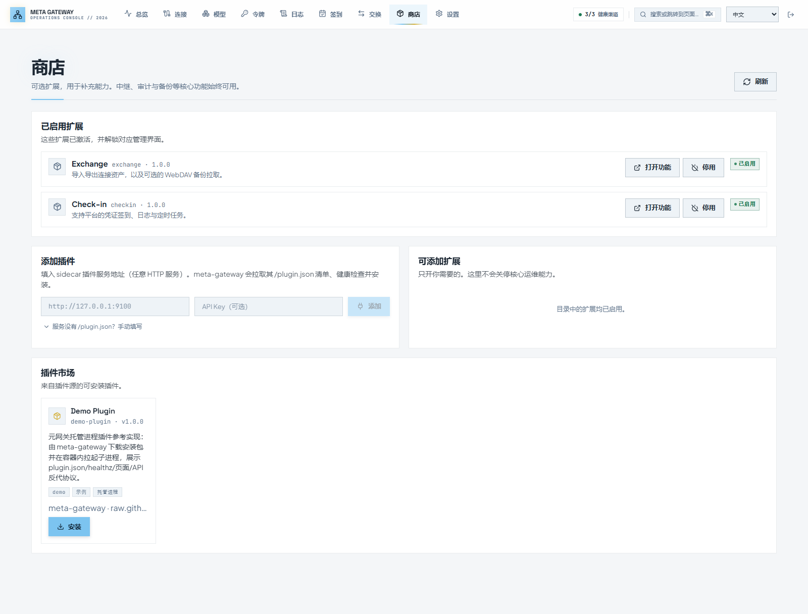
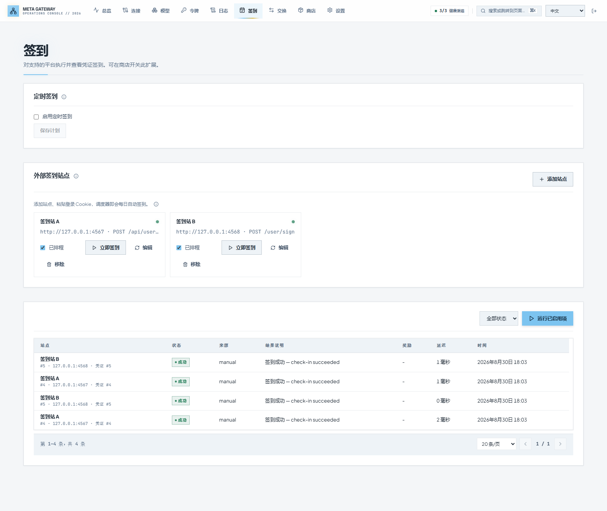
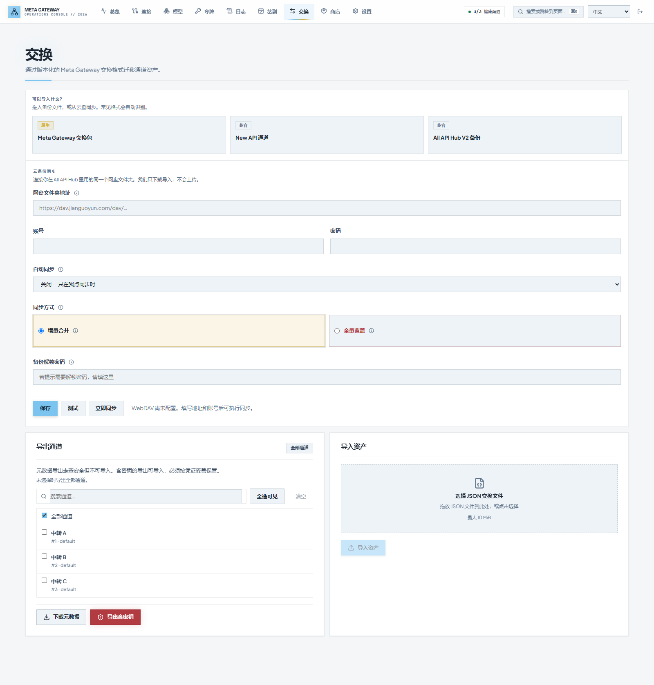

<div align="center">

<h1>Meta Gateway</h1>

**多通道 AI 中继网关 — 多站聚合 · 智能路由 · 故障转移**

把分散在各处的 AI API 聚合成一个入口。下游工具（Cursor、Claude Code、Open WebUI…）
只配一个地址、一个令牌，就能用上所有站点的模型；
哪个站点挂了，流量自动绕开。

<p>

<a href="https://hub.docker.com/r/zichuanlan/meta-gateway">
  
</a>
<a href="https://github.com/ZiChuanLan/meta-gateway/releases">
  
</a>
<a href="https://github.com/ZiChuanLan/meta-gateway/blob/master/LICENSE">
  
</a>


</p>

<p>
  <a href="#快速开始"><strong>快速开始</strong></a> ·
  <a href="#接入下游">接入下游</a> ·
  <a href="#功能特性">功能特性</a> ·
  <a href="#界面预览">界面预览</a> ·
  <a href="#配置说明">配置</a> ·
  <a href="#架构设计">架构</a> ·
  <a href="#常见问题">FAQ</a>
</p>

</div>

---

## 简介

现在的 AI 中转站大多基于 New API / One API：手里有三五个站，每个站有自己的余额、模型列表和 API Key。工具越接越多，配置越来越乱——想换一个站，所有客户端都得跟着改。

Meta Gateway 架在这些站点之上：所有站点挂到同一个网关后面，下游只看到一个地址、一个令牌。模型自动汇总，请求按优先级分流，单个站点故障时自动绕开。

| 你可能遇到 | Meta Gateway 的做法 |
| --- | --- |
| 每个站点一个 Key，下游工具要配一堆 | 统一代理入口，一个下游令牌访问全部模型 |
| 不清楚哪个站点调某个模型更稳 | 按优先级与权重自动选通道，可按时延和错误率动态调整 |
| 站点挂了要手动换 Key | 通道失败自动冷却并切换下一个，恢复后自动回归 |
| 同一个模型想固定走某个渠道 | 模型页锁定单通道，或按场景建路由分组 |
| 每天要去各站签到领额度 | 定时自动签到，支持外站 Cookie |
| 不知道哪个站有什么模型 | 自动模型发现，上游新增模型零配置出现 |
| 上游模型更名或从清单消失 | 模型页查看渠道级变更、预览并批量替换上游映射 |
| 想加功能又不想改核心代码 | 插件市场(待续)一键安装社区扩展 |

支持的上游：

- **聚合面板**：New API、One API、OneHub、DoneHub、Veloera、AnyRouter、Sub2API 等
- **通用兼容接口**：OpenAI / Anthropic / Gemini compatible endpoints
- **官方预设**：DeepSeek、智谱 GLM、月之暗面 Moonshot、MiniMax 等

> 在线体验：[https://mg.015201314.xyz](https://mg.015201314.xyz)
密码 ：`123456`

---

## 上游模型变更维护

模型页顶部的「上游模型变化」汇总待处理的新增、疑似移除和受影响路由；展开后可按渠道、变化类型、处理状态及模型名筛选。

- 只比较同一渠道的成功同步清单。首次同步建立基线，失败不产生移除记录；升级前已有的发现清单作为基线，无法恢复此前被覆盖的历史。
- 模型从某渠道清单消失，只表示该渠道「疑似移除」，不代表其他渠道或官方已下线。同步保留原路由和成员，不再自动删除，便于人工维护。
- 同次同步新增的模型仅作为候选，不根据名称猜测新版。选择变更 → 目标模型 → 受影响成员 → 预览 → 确认应用。
- 同渠道的多条移除记录可以一起替换，也可显式开启「选择其他渠道的模型」。只改成员上游映射，对外模型名、路由名及其他配置不变。
- 忽略仅关闭提醒，不会修复映射或停用成员。部分成员替换后，仍受影响的成员继续待处理；预览过期时必须重新预览。

## 界面预览

<table>
  <tr>
    <td align="center">
      
      <div><b>登录页</b> — ADMIN_TOKEN 认证，令牌仅存于浏览器内存</div>
    </td>
    <td align="center">
      
      <div><b>总览</b> — 流量统计、渠道健康、最近请求</div>
    </td>
  </tr>
  <tr>
    <td align="center">
      
      <div><b>上游连接</b> — 多站点管理、模型同步模式、健康状态</div>
    </td>
    <td align="center">
      
      <div><b>模型路由</b> — 成员分组、优先级、统一名称、模型探测</div>
    </td>
  </tr>
  <tr>
    <td align="center">
      
      <div><b>令牌管理</b> — 下游令牌、配额计费、路由分组绑定</div>
    </td>
    <td align="center">
      
      <div><b>插件商店</b> — 市场浏览、一键安装与托管运行</div>
    </td>
  </tr>
  <tr>
    <td align="center">
      
      <div><b>签到调度</b> — 多站点定时签到、执行日志</div>
    </td>
    <td align="center">
      
      <div><b>资产交换</b> — 连接配置导入导出、WebDAV 备份</div>
    </td>
  </tr>
</table>

---

## 快速开始

### 方式一：Docker Compose（推荐）

镜像发布在 Docker Hub（`zichuanlan/meta-gateway`），提供 amd64 / arm64 双架构，随 [Releases](https://github.com/ZiChuanLan/meta-gateway/releases) 发版。

```bash
mkdir meta-gateway && cd meta-gateway

cat > docker-compose.yml << 'EOF'
services:
  meta-gateway:
    # 想锁定版本就把 latest 换成具体版本号，如 v2.0.2（见下方「升级」）
    image: zichuanlan/meta-gateway:latest
    ports:
      - "4100:4100"
    volumes:
      - ./data:/data
    environment:
      ADMIN_TOKEN: ${ADMIN_TOKEN:?ADMIN_TOKEN is required}
      MASTER_KEY: ${MASTER_KEY:?MASTER_KEY is required}
      METRICS_TOKEN: ${METRICS_TOKEN:?METRICS_TOKEN is required}
    restart: unless-stopped
EOF

# 设置密钥并启动
export ADMIN_TOKEN=your-admin-token
export MASTER_KEY=your-32-char-master-key-for-encryption!!
export METRICS_TOKEN=your-metrics-token
docker compose up -d
```

启动后访问 `http://localhost:4100/console/`，用 `ADMIN_TOKEN` 登录。

<details>
<summary><strong>一行 Docker 命令</strong></summary>

```bash
docker run -d --name meta-gateway \
  -p 4100:4100 \
  -e ADMIN_TOKEN=your-admin-token \
  -e MASTER_KEY=your-32-char-master-key-for-encryption!! \
  -e METRICS_TOKEN=your-metrics-token \
  -v ./data:/data \
  --restart unless-stopped \
  zichuanlan/meta-gateway:latest
```

</details>

> [!IMPORTANT]
> 请务必修改 `ADMIN_TOKEN`、`MASTER_KEY` 和 `METRICS_TOKEN`，不要使用默认值。数据存储在 `./data` 目录，升级不会丢失。

### 方式二：源码构建

```bash
# 前置条件
# Go 1.26+ / Node.js 24+（仅构建前端）/ SQLite（内嵌，无需安装）

git clone https://github.com/ZiChuanLan/meta-gateway.git
cd meta-gateway

# 构建前端
cd web && npm ci && npm run build && cd ..

# 构建后端
go build -o bin/meta-gateway ./cmd/server

# 启动
ADMIN_TOKEN=my-token MASTER_KEY=my-32-char-key-for-encryption! ./bin/meta-gateway
```

### 验证

```bash
curl http://127.0.0.1:4100/readyz
# → {"status":"ok"}
```

### 升级

```bash
docker compose pull && docker compose up -d
```

数据都在 `./data` 目录（SQLite + 备份），升级不会丢失。每个版本的变化见
[Releases](https://github.com/ZiChuanLan/meta-gateway/releases)；开启「检查更新」后，有新版本时控制台顶栏会直接提示（设置 → 运行参数可关闭）。想固定在某个版本、不受 `latest` 更新影响的话，把 compose 里的 tag 换成具体版本号（如 `v2.0.2`）即可。

---

## 接入下游

1. 管理后台 → 令牌 → 创建令牌（可设额度、计费单价、路由分组）
2. 客户端的 API 地址指向网关，令牌填刚创建的下游令牌：

```bash
curl http://localhost:4100/v1/chat/completions \
  -H "Authorization: Bearer <你的下游令牌>" \
  -H "Content-Type: application/json" \
  -d '{
    "model": "deepseek-v4-flash",
    "messages": [{ "role": "user", "content": "你好" }]
  }'
```

OpenAI SDK（Python / JS / Go 同理）：

```python
from openai import OpenAI

client = OpenAI(
    base_url="http://localhost:4100/v1",
    api_key="<你的下游令牌>",
)

resp = client.chat.completions.create(
    model="deepseek-v4-flash",
    messages=[{"role": "user", "content": "你好"}],
)
print(resp.choices[0].message.content)
```

Cursor、Cherry Studio、Open WebUI 等客户端：Base URL 填 `http://<网关地址>:4100/v1`，API Key 填下游令牌，协议选 OpenAI 兼容。走 Anthropic 协议的客户端（如 Claude Code）同样把地址指向 `/v1`、选 Anthropic 协议即可——网关会在 OpenAI / Anthropic / Gemini 三种协议之间自动互译。

可用模型列表：`GET /v1/models`。

---

## 功能特性

### 中继与协议

- OpenAI 兼容接口：`/v1/chat/completions`、`/v1/completions`、`/v1/embeddings`、`/v1/responses`、`/v1/images/*`
- Anthropic `/v1/messages`、Gemini 原生协议，与 OpenAI 格式自动互译——客户端用哪种协议都能调任意上游
- SSE 流式传输全链路支持
- 下游令牌按作用域限权（`relay` / `chat` / `models` / `embeddings` 等）

### 路由与容错

- 优先级分层、同层按权重分流；可开启时延与错误率感知
- 失败自动重试：同通道换 Key → 跨通道转移，重试上限由 `RETRY_TIMES` 控制
- 失败通道进入冷却，到期自动恢复探测；连续失败可自动禁用
- 路由分组：同一模型可建多个成员分组（比如「日常」和「跑批」各一套优先级），分组内独立排序；新建分组可一键复制 default 的全部成员
- 令牌绑定分组：给下游令牌指定分组名，它发出的请求只在该分组内选通道、只在分组内转移，不影响主链路
- 灰度发布：`stable_first` 通道先承接小流量，验证后自动转正

### 多站点管理

- 多站点统一管理面板，凭证 AES 加密存储
- 自动模型发现：一键同步上游模型并生成路由；渠道可设 auto / manual 同步模式，auto 渠道的新模型自动上线
- 模型名称统一：跨渠道识别同一模型的不同命名，一键归一，操作可整体撤销
- 模型探测：对渠道 + 模型发起真实调用，验证「列表里有」不等于「真的能用」
- 模型级优先级可覆盖渠道全局排序，支持拖拽与批量操作

### 运维

- 签到调度：New API / One API 系站点定时签到，外站 Cookie 签到
- 资产交换：连接配置导入导出，WebDAV 云备份
- 审计日志、SQLite 在线备份与校验恢复
- 告警规则：指标 → Webhook（Bark / ServerChan / Telegram / SMTP）
- 运行时热配置：重试次数、限流、审计保留等在线调整，无需重启

### 插件

- 插件市场一键安装，网关托管插件进程并自动健康检查
- `config_fields` 声明式配置，secret 自动掩码
- 官方扩展（Exchange、Check-in）目前为内置功能，插件化适配中

---

## 配置说明

### 必填环境变量

| 变量 | 说明 |
| --- | --- |
| `ADMIN_TOKEN` | 管理后台登录令牌（Bearer Token） |
| `MASTER_KEY` | 数据加密密钥（≥32 字符，用于加密凭证） |
| `METRICS_TOKEN` | `/metrics` 端点访问令牌 |

### 可选环境变量

| 变量 | 默认值 | 说明 |
| --- | --- | --- |
| `HTTP_ADDR` | `:4100` | 监听地址 |
| `DATA_DIR` | `./data` | 数据存储目录 |
| `EXCHANGE_ALLOW_SECRET_EXPORT` | `true` | 允许导出含密钥的资产 |
| `BACKUP_RETENTION_COUNT` | `30` | 备份保留数量（0 禁用） |
| `RETRY_TIMES` | `2` | 重试轮次（每个轮次多尝试一个通道） |
| `CHANNEL_RETRY_TIMES` | `1` | 同通道重发次数 |
| `CHANNEL_AUTO_DISABLE_THRESHOLD` | `5` | 连续失败后自动禁用阈值（0 禁用） |
| `ROUTING_LATENCY_AWARE` | `true` | 延迟感知路由 |
| `ROUTING_ERROR_AWARE` | `true` | 错误率感知路由 |
| `CROSS_CHANNEL_FAILOVER_ENABLED` | `true` | 跨通道故障转移 |
| `CHECKIN_ENABLED` | `false` | 启用签到调度 |
| `CHECKIN_TZ` | (系统) | 签到时区（如 `Asia/Shanghai`） |
| `PLUGIN_MARKET_URLS` | (内置) | 额外插件市场源（逗号分隔） |

部署、备份、审计等运维细节见 [docs/operations.md](docs/operations.md)。

---

## 架构设计

```
┌─────────────────────────────────────────────────────────┐
│                    下游客户端                             │
│         Cursor / Claude Code / Open WebUI / ...         │
└───────────────────────┬─────────────────────────────────┘
                        │ Bearer Token
                        ▼
┌─────────────────────────────────────────────────────────┐
│                  Meta Gateway                            │
│                                                         │
│  ┌──────────┐  ┌──────────┐  ┌──────────┐              │
│  │ 令牌验证  │→│ 模型路由  │→│ 重试/故障 │              │
│  │          │  │ 优先级   │  │ 转移      │              │
│  └──────────┘  │ 权重     │  └────┬─────┘              │
│                └──────────┘       │                      │
│                                   ▼                      │
│  ┌──────────────────────────────────────────┐           │
│  │            出站策略（SSRF 防护）           │           │
│  │  DNS 校验 · 重定向校验 · 代理路由          │           │
│  └──────────────────────────────────────────┘           │
└───────────────────────┬─────────────────────────────────┘
                        │
        ┌───────────────┼───────────────┐
        ▼               ▼               ▼
   ┌─────────┐    ┌─────────┐    ┌─────────┐
   │ 站点 A   │    │ 站点 B   │    │ 站点 C   │
   │ New API  │    │ One API  │    │ 原生 API │
   └─────────┘    └─────────┘    └─────────┘
```

模型选择、分组回退、重试与冷却的完整规则见 [docs/architecture.md](docs/architecture.md)。

---

## API 概览

### 公开端点（需要下游 Key）

| 方法 | 路径 | 说明 |
| --- | --- | --- |
| GET | `/v1/models` | 可用模型列表 |
| POST | `/v1/chat/completions` | 聊天补全（支持 SSE） |
| POST | `/v1/completions` | 文本补全 |
| POST | `/v1/embeddings` | 向量嵌入 |
| POST | `/v1/responses` | OpenAI Responses API |
| POST | `/v1/messages` | Anthropic Messages API |
| POST | `/v1/images/generations` | 图片生成 |
| GET | `/v1/dashboard/billing/credit_summary` | 额度/余额查询 |
| POST | `/v1/redemption/redeem` | 兑换额度码 |

### 管理端点（需要 ADMIN_TOKEN）

| 方法 | 路径 | 说明 |
| --- | --- | --- |
| GET | `/admin/sites` | 上游站点列表 |
| POST | `/admin/sites` | 创建站点 |
| GET | `/admin/channels` | 通道列表 |
| POST | `/admin/channels` | 创建通道 |
| GET | `/admin/routes` | 模型路由列表 |
| POST | `/admin/routes` | 创建模型路由 |
| GET | `/admin/route-groups` | 全系统成员分组名列表 |
| POST | `/admin/routes/{id}/groups/copy` | 复制成员分组（如从 default 播种新分组） |
| GET | `/admin/downstream-keys` | 下游 Key 列表 |
| POST | `/admin/downstream-keys` | 创建下游 Key |
| GET | `/admin/plugins/status` | 插件状态 |
| GET | `/admin/checkin/logs` | 签到日志 |
| POST | `/admin/exchange/export` | 导出资产 |
| POST | `/admin/exchange/import` | 导入资产 |
| POST | `/admin/backups` | 创建备份 |

---

## 安全边界

- **凭证加密**：所有密钥使用 AES 加密存储，解密仅在请求构造时发生，日志和 API 响应中不出现明文
- **出站策略**：所有出站请求走统一 SSRF 防护——DNS 校验、重定向重校验、跨域凭证移除、环回/内网地址默认拒绝
- **令牌隔离**：ADMIN_TOKEN 仅存于浏览器内存/Tab SessionStorage，不进 Cookie、不进 URL
- **审计留痕**：所有管理操作记录审计事件，支持保留策略
- **插件沙箱**：插件进程继承白名单环境变量，网关密钥（ADMIN_TOKEN/MASTER_KEY）不泄露给插件

---

## 常见问题

<details>
<summary><strong>Q: 支持哪些上游平台？</strong></summary>

支持所有兼容 OpenAI / Anthropic / Gemini 接口的平台，包括但不限于：New API、One API、OneHub、DoneHub、Veloera、AnyRouter、Sub2API、DeepSeek、智谱 GLM、月之暗面 Moonshot 等。连接时选择对应的平台类型即可。
</details>

<details>
<summary><strong>Q: 如何添加一个新的上游站点？</strong></summary>

管理后台 → 连接 → 添加连接 → 填写站点地址和 API Key → 同步模型 → 完成。路由会自动按优先级分配。
</details>

<details>
<summary><strong>Q: 如何配置自动故障转移？</strong></summary>

默认已启用。为同一个模型配置多个通道（不同优先级），高优先级通道失败时会自动尝试低优先级通道。可通过 `RETRY_TIMES` 调整重试轮次，`CHANNEL_AUTO_DISABLE_THRESHOLD` 调整自动禁用阈值。
</details>

<details>
<summary><strong>Q: 路由分组什么场景用？</strong></summary>

比如同一个模型在三个渠道都有：把主力渠道留在 default，其余渠道拉进一个新分组，然后给跑批或测试用的下游令牌绑定这个分组——这些令牌的请求只落在这批渠道上，失败了也只在分组内转移，不会挤占正式流量的主链路。
</details>

<details>
<summary><strong>Q: 支持 Claude 官方 API 吗？</strong></summary>

支持。连接类型选择 "Anthropic (Claude Official)"，填入 API Key，网关会自动处理 Anthropic 认证头和 `/v1/messages` 路径翻译。下游客户端调用标准 `/v1/chat/completions` 即可。
</details>

<details>
<summary><strong>Q: Docker 镜像支持哪些架构？</strong></summary>

支持 `linux/amd64` 和 `linux/arm64`。
</details>

<details>
<summary><strong>Q: 如何备份和恢复？</strong></summary>

管理后台 → 设置 → 备份，点击"创建备份"。恢复时停止服务后运行 `meta-gateway restore --from <备份文件>`。备份包含加密凭证，恢复时需使用相同的 `MASTER_KEY`。
</details>

---

## 参与贡献

欢迎提交 Issue 和 Pull Request！请先阅读 [CONTRIBUTING.md](CONTRIBUTING.md)。

## 开源协议

本项目基于 [MIT License](LICENSE) 开源。

## 致谢

- [LINUX DO](https://linux.do)
- [New API](https://github.com/QuantumNous/new-api) / [One API](https://github.com/songquanpeng/one-api)
- [CLIProxyAPI](https://github.com/router-for-me/CLIProxyAPI)
- [metapi](https://github.com/cita-777/metapi)
- AxonHUB
- All API Hub
- Sub2API
- CC-SWITCH
